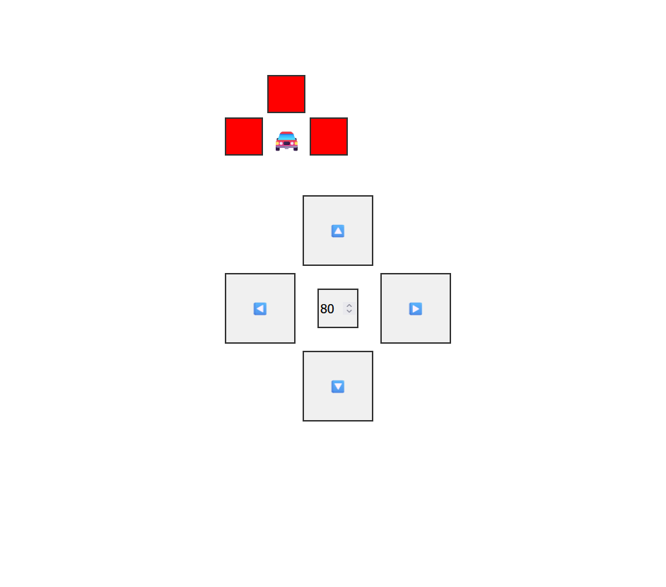

# ESP8266 RC Car

Modified toy RC car with a Wemos D1 Mini (ESP8266), 1x L298N motor driver and 3x VL53L0X for distance measurement.

When it boots, it spawns a new wifi network that allows you to setup a proper wifi network. That network will be remembered next time.

### Websocket messages from the client

- `PING`: 0x1
- MOTOR FORWARD w/ speed: 0x2 0xFF
- MOTOR REVERSE w/ speed: 0x3 0xFF
- MOTOR LEFT w/ speed: 0x4 0xFF
- MOTOR RIGHT w/ speed: 0x5 0xFF
- Stop all motors: 0x6

### Websocket messages from the server

- `PONG`: 0x1
- Sensor data: 0x2 ...

## Webpage

